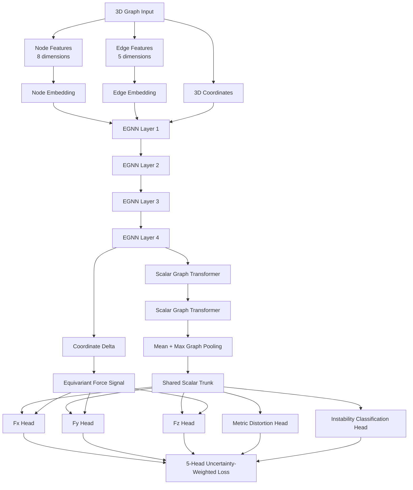
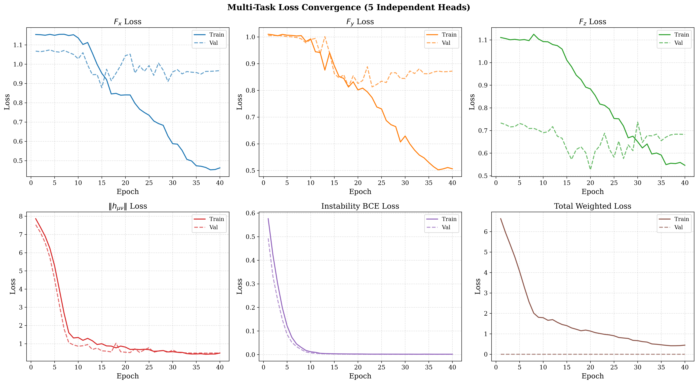
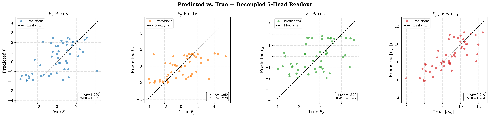
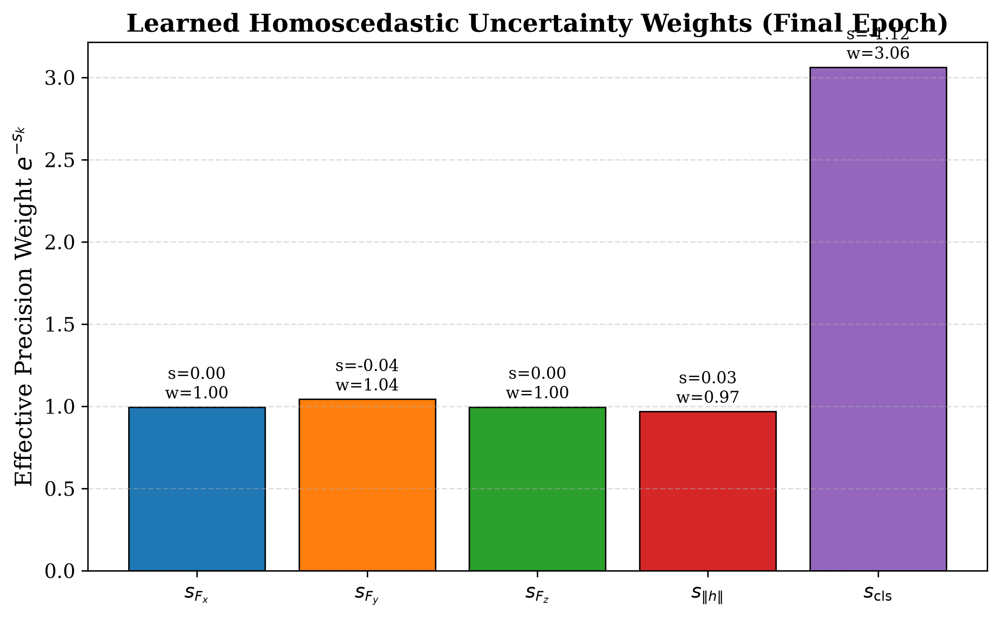

# GNN-T: Edge-Error Prediction for Computational Lithography

<p align="center">

**Equivariant Graph Learning + Graph Transformer + Multi-Task Uncertainty Weighting**

A geometric deep-learning research prototype combining an **E(n)-Equivariant Graph Neural Network (EGNN)** with a **scalar graph transformer** and **five decoupled prediction heads** for multi-task graph-level learning.

</p>

<p align="center">


</p>

---

## Overview

This repository implements a **multi-task geometric graph learning architecture** designed to learn from graph-structured systems containing **node features, edge features, and 3D coordinates**.

The core architecture combines:

> **Graph Input → EGNN Backbone → Scalar Graph Transformer → Multi-Task Heads → Uncertainty-Weighted Loss**

The implementation specifically addresses three architectural challenges:

* preserving directional information through an **equivariant coordinate pathway**,
* capturing long-range interactions using **graph-level self-attention**,
* reducing competition between multiple objectives using **learnable homoscedastic uncertainty weighting**.

The current implementation uses a **synthetically generated exotic metamaterial lattice dataset** with physics-inspired features and targets. It should therefore be regarded as a **research prototype / proof-of-concept**, rather than a validated computational-lithography model.

---

# Architecture

<p align="center">



</p>

---

# 1. Problem Motivation

Graph-structured physical systems contain interactions that are difficult to represent using conventional independent-vector or purely scalar models.

A graph representation allows the model to jointly process:

* **local node properties**
* **pairwise edge interactions**
* **relative spatial geometry**
* **global graph-level relationships**

The major architectural requirement is that directional quantities should respond consistently when the input geometry is transformed.

This motivates the use of an **E(n)-Equivariant Graph Neural Network**, where scalar node representations and spatial coordinates are updated together.

A graph transformer is then applied to the scalar representation to capture **non-local interactions between nodes**.

Finally, the network branches into five independent prediction heads.

---

# 2. Research Architecture

The model is implemented as:

```text
                    INPUT GRAPH
                        │
        ┌───────────────┼────────────────┐
        │               │                │
   Node Features   Edge Features    Coordinates
      (8-D)            (5-D)             (3-D)
        │               │                │
        └───────┬───────┘                │
                ▼                        │
        Input Embeddings                 │
                │                        │
                ▼                        ▼
        ┌────────────────────────────────────┐
        │          EGNN BACKBONE             │
        │                                    │
        │       EGNN × 4 Layers              │
        │                                    │
        │  Scalar Features + Coordinates     │
        └────────────────┬───────────────────┘
                         │
             ┌───────────┴───────────┐
             │                       │
       Scalar Features          Coordinate Δ
             │                       │
             ▼                       │
     ┌─────────────────┐             │
     │ Graph Transformer│             │
     │     × 2 Layers   │             │
     └────────┬─────────┘             │
              │                       │
              ▼                       ▼
       Mean + Max Pooling      Equivariant Pooling
              │                       │
              ▼                       ▼
       Shared Scalar Trunk     Force Signal
              │                       │
       ┌──────┼──────┬──────┐        │
       ▼      ▼      ▼      ▼        │
      Fx     Fy     Fz   Metric      │
                              │       │
                              ▼       │
                         Classification
                              │       │
       └──────────────┬───────┴───────┘
                      ▼
             Uncertainty Weighting
                      │
                      ▼
                Total Loss
```

---

# 3. Model Components

## 3.1 Graph Representation

Each graph contains:

### Node features — 8 dimensions

| Feature       | Description                           |
| ------------- | ------------------------------------- |
| `ρ_e`         | Negative energy density               |
| `⟨Tᵘᵥ⟩` trace | Vacuum expectation value trace        |
| `P_xx`        | Casimir anisotropic pressure          |
| `P_yy`        | Casimir anisotropic pressure          |
| `P_zz`        | Casimir anisotropic pressure          |
| `Q_i`         | Topological defect charge             |
| `m_eff`       | Effective negative gravitational mass |
| `ω_i`         | Quantum excitation frequency          |

### Edge features — 5 dimensions

| Feature           | Description                    |
| ----------------- | ------------------------------ |
| Distance          | Euclidean spatial distance     |
| Entanglement      | Synthetic concurrence value    |
| Casimir potential | Distance-dependent interaction |
| Geodesic interval | Pseudo-Minkowski approximation |
| Gauge potential   | Synthetic gauge connection     |

The code constructs graph connectivity using a **radius-based graph with a k-nearest-neighbor fallback** when no radius edges are available.

---

# 4. EGNN Backbone

The core geometric component is an **E(n)-Equivariant Graph Neural Network**.

The implementation uses **four EGNN layers**.

Each layer jointly updates:

* scalar node embeddings `h`
* spatial coordinates `x`

The message function incorporates:

$$
m_{ij} =
\phi_e
\left(
h_i,
h_j,
|x_i-x_j|^2,
e_{ij}
\right)
$$

The coordinate update is based on relative vectors:

$$
x_i' =
x_i +
\sum_j
(x_i-x_j)\phi_x(m_{ij})
$$

The use of relative coordinate vectors allows the coordinate channel to transform consistently under Euclidean transformations.

The implementation also uses:

* residual scalar updates
* coordinate normalization
* `tanh`-clamped coordinate weights
* LayerNorm
* SiLU activations

These mechanisms are implemented directly in the custom `EGNNLayer`.

---

# 5. Scalar Graph Transformer

After the EGNN backbone, the scalar node representation is processed by **two graph transformer layers**.

The transformer uses:

* 4 attention heads
* query/key/value projections
* scaled dot-product attention
* residual connections
* LayerNorm
* GELU feed-forward layers
* dropout

Importantly, the transformer operates on the **scalar channel only**.

This creates a deliberate division of responsibilities:

```text
EGNN
│
├── Handles geometric / coordinate equivariance
│
└── Produces invariant scalar representations
                         │
                         ▼
                  Graph Transformer
                         │
                  Handles long-range
                  scalar interactions
```

The transformer performs dense attention separately within each graph in the batch.

---

# 6. Five-Head Multi-Task Architecture

The model does not use one shared output layer.

Instead, it contains **five independent prediction heads**:

| Head   | Target                      | Type                  |
| ------ | --------------------------- | --------------------- |
| Head 1 | `F_x`                       | Regression            |
| Head 2 | `F_y`                       | Regression            |
| Head 3 | `F_z`                       | Regression            |
| Head 4 | `‖hᵤᵥ‖` / metric distortion | Regression            |
| Head 5 | Instability                 | Binary classification |

The first three force components use an equivariant coordinate-derived signal.

The fourth and fifth heads use the invariant scalar representation.

The classification branch additionally applies a **0.1 gradient scaling factor** so that its gradients do not dominate the shared representation.

---

# 7. Equivariant Force Readout

The model stores the original coordinates:

```python
x_init = pos.clone()
```

and compares them with the coordinates after the EGNN backbone:

```python
coord_delta = x_eq - x_init
```

The coordinate displacement is then graph-pooled:

```python
coord_delta_pooled = global_mean_pool(coord_delta, batch)
```

A learned correction is added to this signal before the three force heads produce:

```text
Fx
Fy
Fz
```

This creates an explicit geometric pathway for directional predictions rather than deriving all three components solely from scalar graph embeddings.

---

# 8. Multi-Task Uncertainty Weighting

The five objectives have different scales and learning characteristics.

To balance them, the repository implements **learnable homoscedastic uncertainty parameters**.

For the four regression objectives:

$$
L_k =
\frac{1}{2}
e^{-s_k}L_k^{reg}
+
\frac{1}{2}s_k
$$

For classification:

$$
L_5 =
e^{-s_5}L_5^{cls}
+
\frac{1}{2}s_5
$$

The complete objective is:

$$
L =
\sum_{k=1}^{4}
\left[
\frac{1}{2}e^{-s_k}L_k^{reg}
+
\frac{1}{2}s_k
\right]
+
e^{-s_5}L_5^{cls}
+
\frac{1}{2}s_5
$$

where each `s_k` is learned during training.

The implementation uses:

* Smooth L1 loss for `Fx`
* Smooth L1 loss for `Fy`
* Smooth L1 loss for `Fz`
* Smooth L1 loss for metric distortion
* Binary cross-entropy with logits for classification

Five independent learnable uncertainty parameters are optimized together with the network.

---

# 9. Dataset

## Synthetic Dataset

The current implementation generates the dataset internally using the `ExoticLatticeDataset` class.

The final execution configuration generates:

| Parameter         | Value |
| ----------------- | ----: |
| Total graphs      |   350 |
| Training graphs   |   244 |
| Validation graphs |    53 |
| Test graphs       |    53 |
| Nodes per graph   | 15–30 |
| Node features     |     8 |
| Edge features     |     5 |
| Radius cutoff     |   5.0 |
| Random seed       |    42 |

The dataset is generated using 3D coordinates sampled within a spatial range and physics-inspired synthetic quantities.

### Important

This repository currently **does not use a real computational-lithography dataset**.

The present dataset is synthetic and is intended to demonstrate the graph-learning architecture and multi-task training pipeline.

Therefore, the current results should be interpreted as **proof-of-concept model behavior**, not as validated lithography prediction performance.

---

# 10. Training Configuration

The main training configuration is:

| Parameter                     | Configuration         |
| ----------------------------- | --------------------- |
| Hidden dimension              | 128                   |
| EGNN layers                   | 4                     |
| Transformer layers            | 2                     |
| Attention heads               | 4                     |
| Dropout                       | 0.1                   |
| Classification gradient scale | 0.1                   |
| Batch size                    | 16                    |
| Epochs                        | 40                    |
| Warmup                        | 5 epochs              |
| Optimizer                     | AdamW                 |
| Initial learning rate         | `5 × 10⁻⁴`            |
| Weight decay                  | `1 × 10⁻²`            |
| Gradient clipping             | `max_norm = 1.0`      |
| LR schedule                   | Warmup + cosine decay |
| Random seed                   | 42                    |

The model and uncertainty-loss parameters are optimized jointly.

---

# 11. Training Pipeline

The complete pipeline is:

```text
Synthetic Graph Generation
          │
          ▼
Train / Validation / Test Split
          │
          ▼
PyTorch Geometric DataLoader
          │
          ▼
Node + Edge Embedding
          │
          ▼
4 × EGNN Layers
          │
          ▼
2 × Scalar Graph Transformer Layers
          │
          ▼
Graph-Level Pooling
          │
          ▼
Shared Representation
          │
          ├──────────► Fx
          ├──────────► Fy
          ├──────────► Fz
          ├──────────► Metric Distortion
          └──────────► Instability
                         │
                         ▼
              Uncertainty-Weighted Loss
                         │
                         ▼
                  Backpropagation
                         │
                         ▼
                    AdamW Update
```

The training loop also applies gradient clipping with a maximum norm of `1.0`.

---

# 12. Results & Visualizations

The repository includes three generated publication-style figures.

## 12.1 Multi-Task Loss Convergence

<p align="center">
  
</p>

**Figure 1 — Per-head loss convergence.**

The figure tracks the training and validation behavior of the five task-specific losses together with the total weighted objective.

The implementation generates separate curves for:

* `F_x`
* `F_y`
* `F_z`
* metric distortion
* instability classification
* total weighted loss

The figure is generated directly from the training history collected during the 40-epoch experiment.

---

## 12.2 Prediction Parity

<p align="center">
  
</p>

**Figure 2 — Predicted vs. true values for the regression heads.**

The parity visualization compares predictions against ground-truth synthetic targets for:

* `F_x`
* `F_y`
* `F_z`
* metric distortion

The dashed diagonal represents the ideal:

$$
y_{pred}=y_{true}
$$

The figure is intended to visualize regression behavior and prediction alignment across the four continuous outputs.

---

## 12.3 Learned Uncertainty Weights

<p align="center">
  
</p>

**Figure 3 — Learned homoscedastic uncertainty weights.**

The model learns a separate uncertainty parameter for each task.

The effective precision is:

$$
w_k=e^{-s_k}
$$

Higher effective precision corresponds to a larger contribution of that task's raw loss to the combined objective.

The figure reports both the learned `s_k` values and their corresponding effective precision weights.

---

# 13. Evaluation

The evaluation pipeline computes:

### Regression

* MAE
* RMSE

for:

```text
Fx
Fy
Fz
Metric Distortion
```

### Classification

Binary classification accuracy is calculated for the instability head using a probability threshold of `0.5`.

### Prediction Variance

The implementation also tracks the prediction variance of:

```text
Fx
Fy
Fz
```

which provides an additional diagnostic for overly collapsed predictions.

---

# 14. Technologies

| Technology             | Role                                          |
| ---------------------- | --------------------------------------------- |
| **Python**             | Main implementation                           |
| **PyTorch**            | Neural-network framework                      |
| **PyTorch Geometric**  | Graph representation and message passing      |
| **Matplotlib**         | Training and evaluation visualization         |
| **EGNN**               | Geometric equivariant representation learning |
| **Graph Transformer**  | Long-range scalar attention                   |
| **AdamW**              | Model optimization                            |
| **Cosine LR schedule** | Learning-rate control                         |

---

# 15. Repository Structure

```text
GNN-T_Edge-Error-Prediction-for-Computational-Lithography/
│
├── GNN T.py
│   └── Complete dataset, model, training,
│       evaluation and visualization pipeline
│
├── per_head_loss_convergence.png
│   └── Multi-task training/validation loss curves
│
├── per_component_parity.png
│   └── Prediction vs. target parity plots
│
├── uncertainty_weights.png
│   └── Learned task uncertainty / precision weights
│
├── README.md
│
└── .gitignore
```

The current repository consists of a compact single-script research implementation and generated result visualizations.

---

# 16. Installation

Clone the repository:

```bash
git clone https://github.com/ALLENJOE-A/GNN-T_Edge-Error-Prediction-for-Computational-Lithography.git

cd GNN-T_Edge-Error-Prediction-for-Computational-Lithography
```

Install the required Python packages:

```bash
pip install torch
pip install torch-geometric
pip install matplotlib
```

For CUDA-enabled PyTorch installations, use the PyTorch installation command appropriate for your CUDA version.

---

# 17. Running the Project

Run the complete experiment using:

```bash
python "GNN T.py"
```

The script will:

1. Generate the synthetic graph dataset.
2. Create train/validation/test splits.
3. Initialize the EGNN + Transformer model.
4. Initialize the five-head uncertainty loss.
5. Train for 40 epochs.
6. Evaluate the validation and test sets.
7. Generate regression and classification metrics.
8. Generate publication-style figures.

The script automatically uses CUDA when available:

```python
device = torch.device(
    "cuda" if torch.cuda.is_available() else "cpu"
)
```

---

# 18. Key Design Decisions

## Why EGNN?

Directional quantities cannot always be represented adequately by purely invariant scalar graph embeddings.

The EGNN provides an explicit coordinate channel that allows geometric information to propagate through the network.

## Why a Graph Transformer?

EGNN message passing primarily operates through graph connectivity.

The scalar transformer adds dense within-graph attention, providing a mechanism for modeling longer-range relationships between nodes.

## Why Five Independent Heads?

A single output layer can cause different objectives to compete for the same representation.

Separating the objectives allows:

```text
Force X ──────────────► Head 1
Force Y ──────────────► Head 2
Force Z ──────────────► Head 3
Metric Distortion ────► Head 4
Instability ──────────► Head 5
```

Each task can therefore learn its own final representation.

## Why Uncertainty Weighting?

The regression and classification objectives have different scales.

Learnable uncertainty parameters dynamically adjust their relative contributions during training rather than requiring fixed manually selected weights.

---

# 19. Research Significance

The main research-oriented contribution of this implementation is the combination of several architectural ideas in a single multi-task graph-learning pipeline:

```text
                  Geometric Learning
                         │
                       EGNN
                         │
                         ▼
              Equivariant Coordinates
                         │
                         ▼
              Scalar Graph Transformer
                         │
                         ▼
                 Global Representation
                         │
          ┌──────────────┼──────────────┐
          ▼              ▼              ▼
      Regression     Regression    Classification
          │              │              │
          └──────────────┼──────────────┘
                         ▼
               Uncertainty Weighting
```

This provides a flexible foundation for future applications where **geometry, graph connectivity and multiple prediction objectives** need to be learned simultaneously.

---

# 20. Limitations

The current implementation should be considered a **research prototype**.

### Current limitations

* The dataset is **synthetically generated**.
* The physical quantities are physics-inspired synthetic variables rather than measurements from a validated experimental pipeline.
* The current repository does not contain a real computational-lithography dataset.
* No comparison against a production lithography simulator is included.
* No external baseline benchmark is currently provided.
* The implementation is currently concentrated in a single Python file.
* The generated figures demonstrate model behavior but should not be interpreted as evidence of real-world lithography accuracy.

These limitations define the scope of the current prototype and provide clear directions for further development.

---

# 21. Future Work

Potential extensions include:

### Real Lithography Data

Replace the synthetic generator with graph representations extracted from:

* lithography layouts
* mask geometries
* contour data
* SEM-derived structures
* OPC simulations
* edge-placement-error datasets

### Physics-Informed Learning

Introduce physically motivated constraints into the training objective.

### Lithography-Specific Graph Construction

Construct graphs directly from:

```text
Layout Geometry
      ↓
Polygon / Edge Extraction
      ↓
Graph Construction
      ↓
Node + Edge Features
      ↓
EGNN + Transformer
      ↓
Edge-Error Prediction
```

### Baseline Comparison

Benchmark the architecture against:

* MLP
* CNN
* standard GNN
* GAT
* GraphSAGE
* GCN
* ALIGNN
* EGNN-only architecture

### Experiment Management

Future versions could add:

* model checkpoints
* configuration files
* experiment tracking
* reproducible experiment logs
* automated benchmark reports

---

# 22. Current Status

| Component                       | Status              |
| ------------------------------- | ------------------- |
| Synthetic graph generation      | Implemented         |
| Node/edge feature generation    | Implemented         |
| Radius graph construction       | Implemented         |
| k-NN fallback                   | Implemented         |
| EGNN backbone                   | Implemented         |
| Scalar graph transformer        | Implemented         |
| Five prediction heads           | Implemented         |
| Uncertainty-weighted loss       | Implemented         |
| Training pipeline               | Implemented         |
| Validation pipeline             | Implemented         |
| Test evaluation                 | Implemented         |
| MAE / RMSE evaluation           | Implemented         |
| Classification accuracy         | Implemented         |
| Loss visualization              | Implemented         |
| Parity visualization            | Implemented         |
| Uncertainty visualization       | Implemented         |
| Real lithography dataset        | Not yet implemented |
| Lithography-specific validation | Future work         |

---

# 23. References

### E(n)-Equivariant Graph Neural Networks

Satorras, V. G., Hoogeboom, E., & Welling, M.

**E(n) Equivariant Graph Neural Networks.**

International Conference on Machine Learning (ICML), 2021.

### Multi-Task Uncertainty Weighting

Kendall, A., & Gal, Y.

**Multi-Task Learning Using Uncertainty to Weigh Losses for Scene Geometry and Semantics.**

Proceedings of the IEEE/CVF Conference on Computer Vision and Pattern Recognition (CVPR), 2018.

---

# 24. Author

**Allen Joe A**

Electronics & VLSI Engineering

GitHub: [@ALLENJOE-A](https://github.com/ALLENJOE-A)

---

<p align="center">

**GNN-T**

*Equivariant Graph Learning for Multi-Task Physical-System Prediction*

</p>
